# SpringWebAlbum
## 技术框架
SpringMVC+jsp，前端使用layui框架，数据库使用SQLServer，如果真的有人想要运行（大概是未来同样要做软工作业的学弟学妹吧……），可以私信524918010@qq.com，我可以把用的数据库发你。  

## 部分页面展示
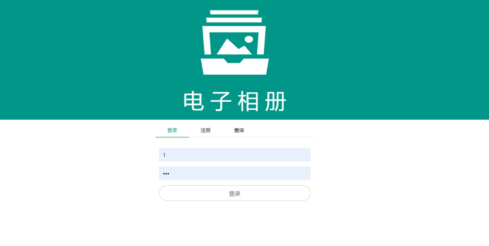  
登入页面，~~从清新的观感出发，采用了扁平设计和绿色的主色调……~~ 为了跟layui的默认风格保持一致，采用了绿色和纯色为主色调。  
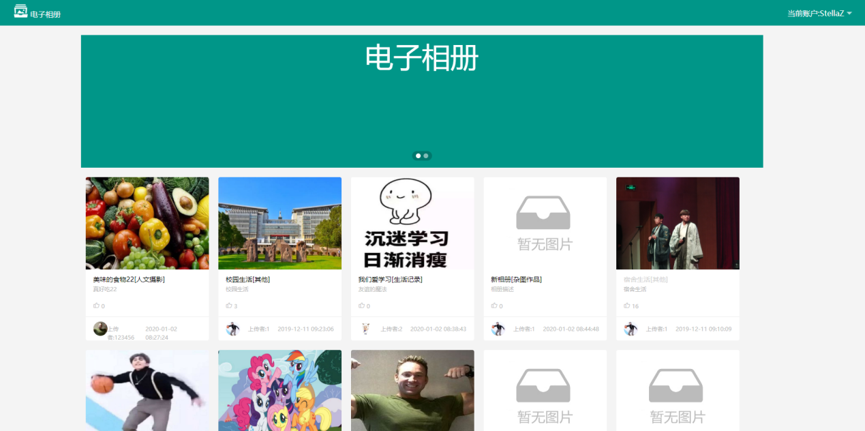  
主页界面，~~抄袭~~ 借鉴了站酷网的主页设计（包括不知道放啥的广告牌banner）。每一个卡片都代表了一个相册，相册中存储多张照片。  
  
导航栏，layui中的组件。  
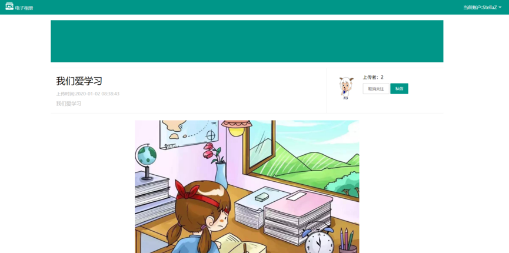  
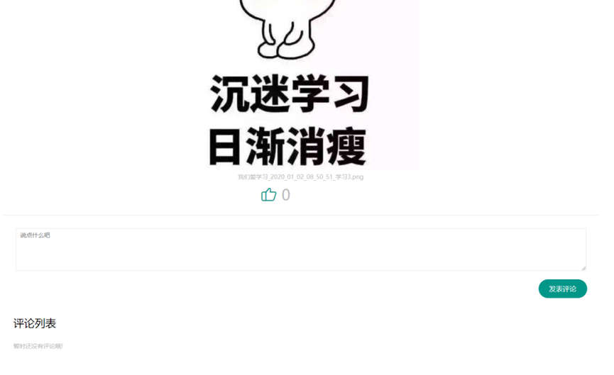  
相册内容和评论功能，继续~~抄袭~~ 借鉴了站酷网以及各类新闻网站的设计，或者说基本都差不多吧，总不能文艺复兴做成QQ相册那种样子……自己可以删除自己的评论。  
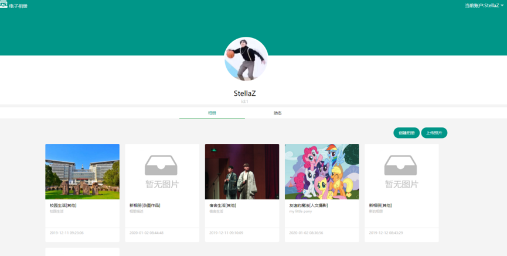  
个人主页，可以在这个界面上划过鼠标删除编辑相册，也可以到后台操作。  
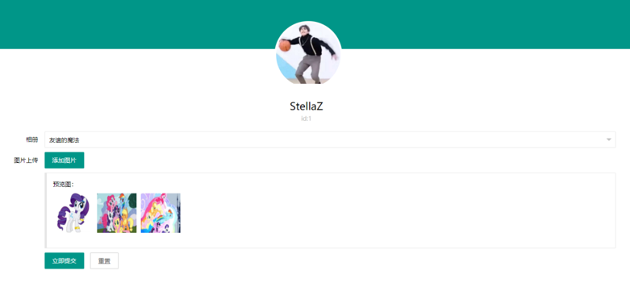    
上传图片，用的layui中一个组件，不过因为懒（毕竟要在考试周答辩）没有做撤销上传，选错图片就要刷新重新上传……  
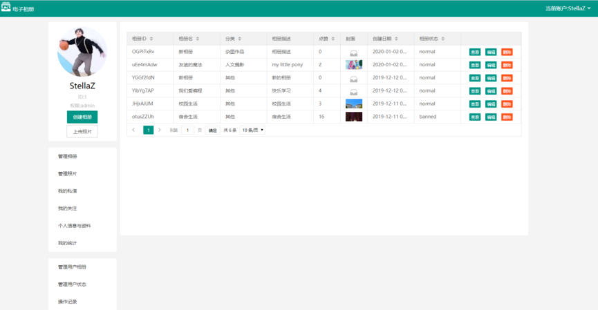  
管理员后台界面，比普通用户多了下面几栏功能，其他的管理自己的相册照片等都一样，可以删除、编辑、设置封面之类的。  
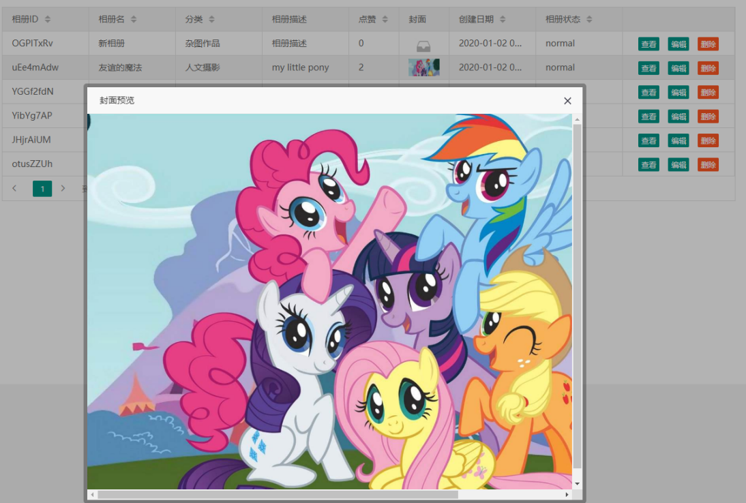  
点击可以预览图片。  
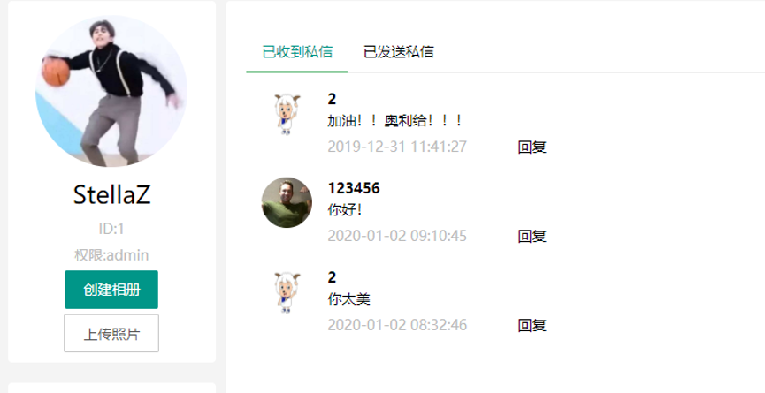  
私信界面，是很简单的数据库读表，没有websocket之类的。    
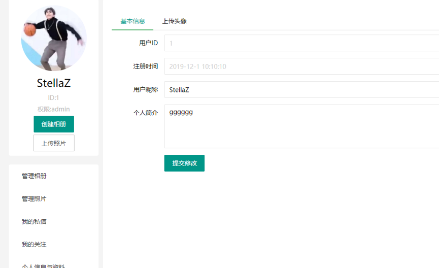  
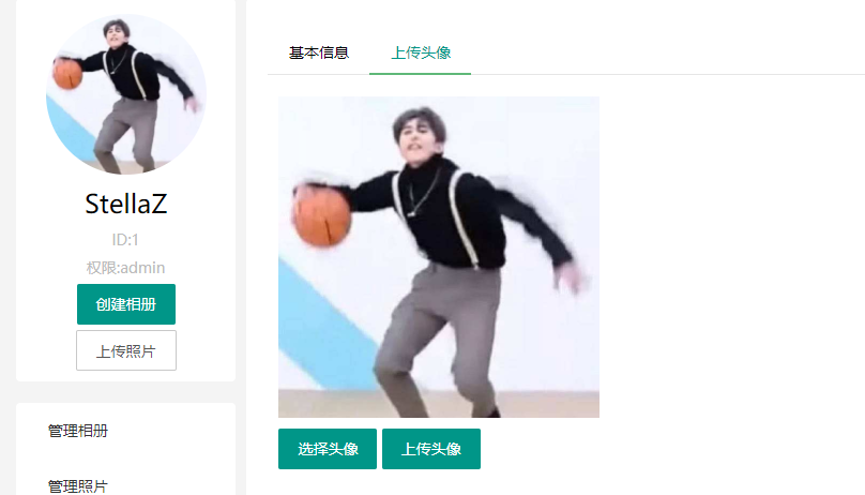  
个人信息，可以设置一些个人资料和头像。  
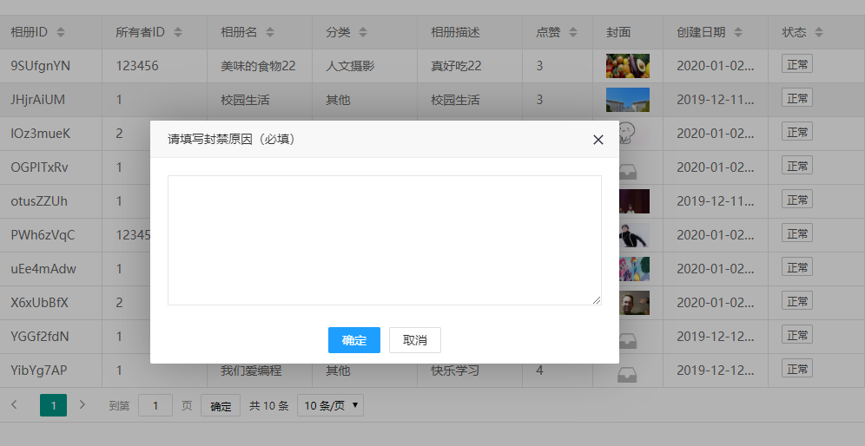  
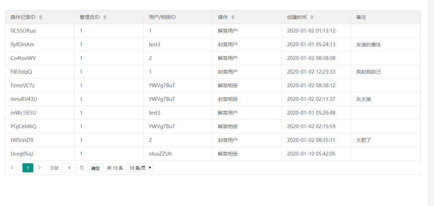  
管理员后台界面，在我们的设计方案里，管理员可以封禁解禁用户和相册，但需要附封禁理由，会记录入库。  
